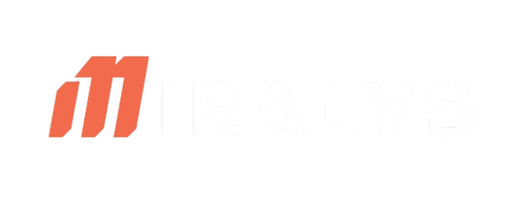
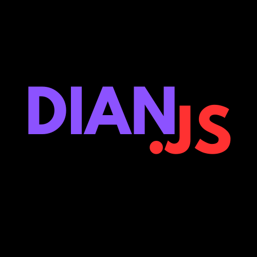
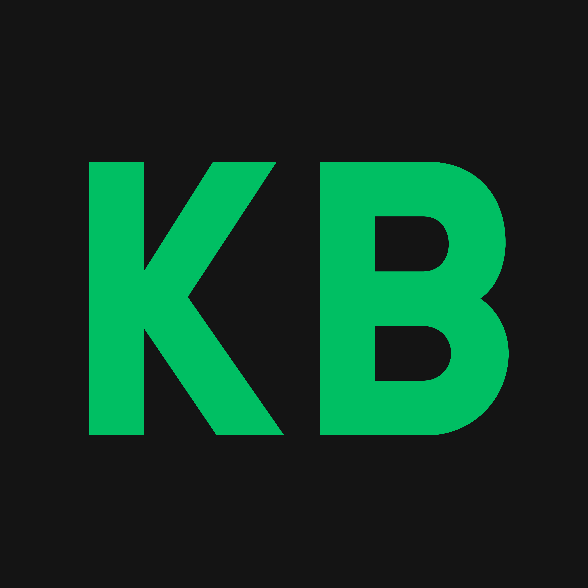

	
	
<b>French Development Organization</b>

	
<i>Building innovative solutions, together.</i>

	

		
		
		
		
		
		
	

---

---

<h2>🚀 About Us</h2>

	<b>Miralys</b> is a French development organization made up of passionate people who love what they do. 
	We are the creators of <b>Discordian</b>, <b>Ayden Discord Bot</b>, <b>Kolba</b>, <b>Miralys Tournament</b> and more!

	We believe in <b>collaboration</b>, <b>innovation</b>, and building a <b>strong community</b>. 
	Our team is always looking for new challenges and opportunities to grow.

---

---

<h2>🌐 Connect with Us</h2>

	<a href="https://miralys.xyz/">🌍 Website</a> &nbsp;|&nbsp;
	<a href="https://discord.gg/ZvPfX4XuKJ">💭 Discord</a> &nbsp;|&nbsp;
	<a href="https://www.instagram.com/miralysproject/">📸 Instagram</a> &nbsp;|&nbsp;
	<a href="https://www.threads.com/@miralysproject">🧵 Threads</a> &nbsp;|&nbsp;
	<a href="https://x.com/miralysproject">✖️ X</a>

---

---

<h2>🛠️ Projects</h2>

<table align="center">
	<tr>
		<td align="center">
			<a href="https://github.com/Miralys-Project/Discordian">
				 
				<b>Discordian</b>
			</a>
			 The ultimate Discord bot development experience
		</td>
		<td align="center">
			<a href="https://ayden.miralys.xyz">
				 
				<b>Ayden Discord Bot</b>
			</a>
			 Your all-in-one Discord assistant
		</td>
		<td align="center">
			<a href="https://www.github.com/Miralys-Project/Kolba">
				 
				<b>Kolba</b>
			</a>
			 Convert COBOL to modern languages
		</td>
		<td align="center">
			<a href="https://github.com/Miralys-Project/Miralys-Tournament">
				 
				<b>Miralys Tournament</b>
			</a>
			 Open source Tournament Manager
		</td>
	</tr>
</table>

<i>And more very soon...</i>

---

---

	Made with ❤️ by the Miralys Team — <a href="mailto:contact@miralys.xyz">contact@miralys.xyz</a>

